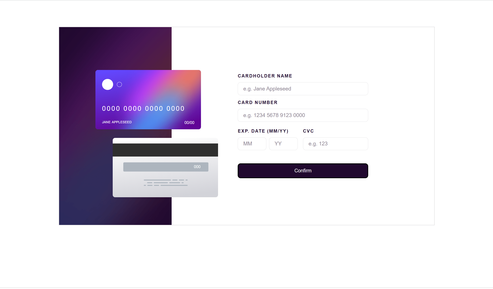
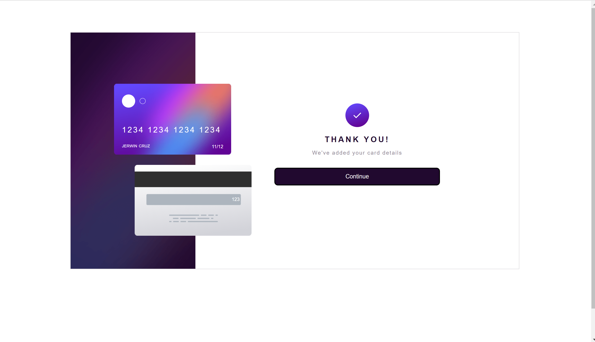

# Frontend Mentor - Interactive card details form solution

This is a solution to the [Interactive card details form challenge on Frontend Mentor](https://www.frontendmentor.io/challenges/interactive-card-details-form-XpS8cKZDWw). Frontend Mentor challenges help you improve your coding skills by building realistic projects.

## Table of contents

- [Overview](#overview)
  - [The challenge](#the-challenge)
  - [Screenshot](#screenshot)
  - [Links](#links)
- [My process](#my-process)
  - [Built with](#built-with)
  - [What I learned](#what-i-learned)
  - [Continued development](#continued-development)
  - [Useful resources](#useful-resources)
- [Author](#author)
- [Acknowledgments](#acknowledgments)

**Note: Delete this note and update the table of contents based on what sections you keep.**

## Overview

### The challenge

Users should be able to:

- See hover states for interactive elements

### Screenshot

### Links

- Solution URL: [Gitbub](https://github.com/cruz-jerwin15/interactivecarddetails.git)
- Live Site URL: [Vercel](https://interactivecarddetails-omega.vercel.app/)

## My process

### Built with

- Semantic HTML5 markup
- CSS custom properties
- Flexbox
- Mobile-first workflow
- JS6

**Note: These are just examples. Delete this note and replace the list above with your own choices**

### What I learned

This is my fifth challenge and first from Junior difficulty and I learned a lot. I learn how to use relative display.

### Continued development

I want to focus first on how I can improve my designing skills for small components with the use of HTML, CSS and JS only.

### Useful resources

-- https://mastery.games/flexboxzombies - This game helped me to learn more on how to use flex box.
-- MDN website

## Author

- Frontend Mentor - [@cruz-jerwin15](https://www.frontendmentor.io/profile/@cruz-jerwin15)
- Twitter - [@jerzcruzzz](https://twitter.com/jerzcruzzz)
